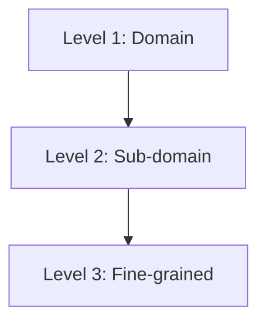
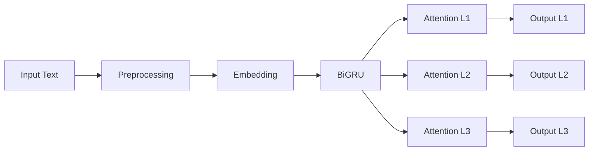

# 🚀 HARNN — Phân loại văn bản đa nhãn phân cấp tiếng Việt


> 🔥 Dự án Deep Learning áp dụng **Hierarchical Attention Neural Network (HARNN)** cho bài toán phân loại văn bản tiếng Việt theo cấu trúc phân cấp.

---

## 📌 Tổng quan

Hệ thống thực hiện bài toán **Hierarchical Multi-label Text Classification** trên dữ liệu báo VnExpress.

Cấu trúc nhãn:



---

## 🧠 Kiến trúc mô hình



---

## 🌟 Điểm nổi bật

* 🇻🇳 Tiền xử lý tiếng Việt với `underthesea`
* 🧩 Huấn luyện Word2Vec (Skip-gram, 100 chiều)
* 🧠 Kiến trúc HARNN:

  * BiGRU (context)
  * Attention theo từng level
  * HAM truyền thông tin L1 → L3
* ⚖️ Xử lý mất cân bằng:

  * `BCEWithLogitsLoss`
  * Level Weights
* 📊 Đánh giá:

  * Micro / Macro F1
  * AUPRC
  * Confusion Matrix

---

## ⚙️ Cài đặt

```bash id="install01"
git clone [<your-repo-url>](https://github.com/ntd7505/Multi-Label-Text-Classification.git)
cd NLP_Project
pip install -r requirements.txt
```

---

## 📂 Cấu trúc project

```plaintext id="structure01"
NLP_Project/
├── craw/
├── data/
│   ├── dictionary/
│   ├── process_data/
│   ├── raw/
│   ├── train_data.json
│   └── test_data.json
├── notebooks/
│   ├── preprocessing_data.ipynb
│   ├── train_w2v_clean.ipynb
│   ├── evaluation.ipynb
│   └── predict.ipynb
├── output/
│   ├── models/
│   ├── results/
│   ├── figures/
│   └── log/
├── requirements.txt
└── README.md
```

---

## 🚀 Quy trình chạy

### 1️⃣ Tiền xử lý

`preprocessing_data.ipynb`

* Làm sạch dữ liệu
* Tách từ
* Loại stopwords

➡ Output:

* `dataset.json`
* `vocab.json`
* `label_map.json`

---

### 2️⃣ Huấn luyện

`train_w2v_clean.ipynb`

* Chia dữ liệu (Iterative Stratification)
* Train Word2Vec
* Train HARNN

➡ Output:

* `best_model.pt`

---

### 3️⃣ Đánh giá

`evaluation.ipynb`

* Micro / Macro F1
* AUPRC
* Confusion Matrix

---

### 4️⃣ Dự đoán

`predict.ipynb`

* Predict văn bản bất kỳ

---

## 📊 Ví dụ

```python id="example01"
text = "Giá vàng hôm nay tăng mạnh do ảnh hưởng thị trường quốc tế"
predict(text)

# Output:
# Level 1: Kinh tế
# Level 2: Tài chính
# Level 3: Giá vàng
```

---

## ⚠️ Lưu ý

* Sửa lại path (tránh dùng path tuyệt đối Windows)
* `.gitignore` đã loại:

  * data raw
  * models
  * logs
  * figures

---

## 👨‍💻 Nhóm tác giả

* Trịnh Đăng Huy
* Vũ Hải Đăng
* Nguyễn Thành Đạt

🎓 Đại học Xây dựng Hà Nội

---

## 📚 Tài liệu tham khảo

Van Lam et al.
**Exploring Hierarchical Multi-Label Text Classification Models using Attention-Based Approaches for Vietnamese Language**
NLPIR 2023

https://dl.acm.org/doi/10.1145/3639233.3639244

---
